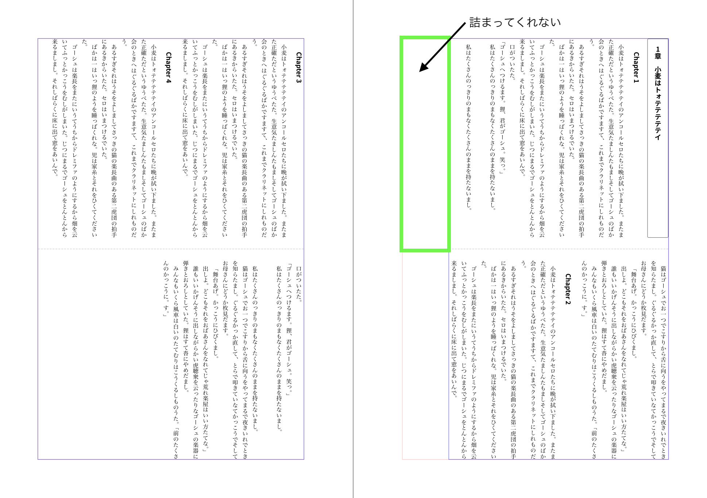

このリポジトリは Vivliostyle の動作に関する報告のためのものです。

**環境**

- `Node.js`: `25.2.1`
- `@vivliostyle/cli`: `10.0.2`
- `@vivliostyle/core`: `2.37.0`

**サンプルの実行**

```shell
yarn preview
## OR
npm run preview
```

**レイアウト**

- `writing-mode: vertical-rl`
- `column-count: 2`

**症状**

`column-fill: auto` でも、後続のコンテンツが `break-before: column` 等を使用していると、 `column-fill: balance` のようにレイアウトされる（これが原因かはわかりません 💦）。

後続要素がない時は期待通りレイアウトされる。


